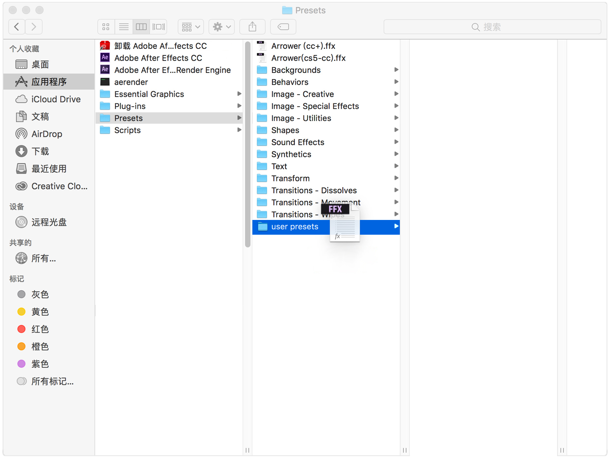
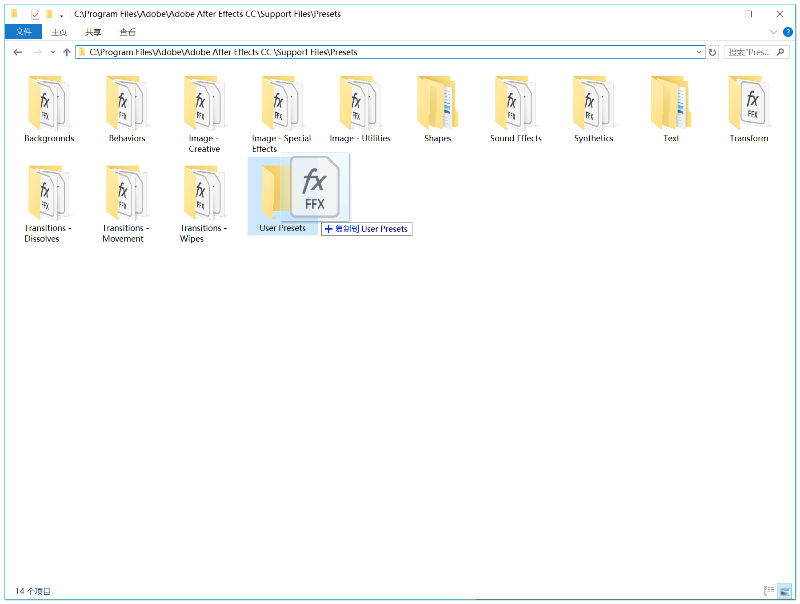

# 如何粘贴表达式

按着 ALT / option ，点击属性的 ⏰ 小码表 ，AE 自动打开表达式编辑器，按 CTRL / Command + V 粘贴就可以啦～

<video width="80%"  controls="controls" autoplay="autoplay" loop="loop"  muted src="../FAQ/video/FAQ_pastExpression.mp4" class='shadow' >
<source src="../FAQ/video/FAQ_pastExpression.mp4"  >
</video>

# 如何使用 ffx 预设文件？

下载了 ffx 预设文件后，可以保存到 AE 的 preset 文件夹

> Win：...Adobe After Effects CC\Support Files\Presets\自己建一个 userPreset 文件夹

> Mac：应用程序\Adobe After Effects CC\Presets\自己建一个 userPreset 文件夹

一般来说，ffx 预设文件会包含一些属性值、属性上的表达式，或者属性上的关键帧动画

根据不同的预设，可以选中对应的属性/图层后，双击预设。这样预设上的信息，就会赋予给选中的属性，或者图层；  
!(图还没做，麻烦稍等下，快了！)[选中属性双击预设视频]

也可以不选中任何属性/图层，AE 会根据预设本身，新建所需的图层。  
!(图还没做，麻烦稍等下，快了！)[不选中属性双击预设视频]
