<script id='parameter'>
{
"expressions":{
    "triWave().js":{
    },

    "sawWave().js":{
        }
    },

"title":"一个跟sin函数差不多的东西，",
"description":"跟 loopOut 的 circle 和 pingpong ，很像"
}
</script>

# 跟 sin 函数差不多，不过一点都不弯 🤪 </br><sub>——三角波与锯齿波</sub>

<video width="100%"  controls="controls" autoplay="autoplay" loop="loop"  muted src="../orginalExpressions/video/triWaveAndSawWave_0.mp4" >
<source src="../orginalExpressions/video/triWaveAndSawWave_0.mp4" >
</video>

## 如何使用

#### sawWave(t, cycle)

> 返回类型：数值  
> 参数类型：t、cycle 是数值。
> 当 t 除以 cycle 的余数，  
> 从 0 增长到 cycle 时，输出 0 到 1

<br>

#### triWave(t, cycle)

> 返回类型：数值  
> 参数类型：t、cycle 是数值。
>
> 当 t 除以 cycle 的余数，  
> 从 0 增长到 cycle/2 时，输出 0 到 1 ；
>
> 当 t 除以 cycle 的余数，  
> 从 cycle/2 增长到 cycle/2 时，输出 1 到 0 ；

<!-- !( 标记 0 1 t cycle 的函数图像 )[] -->

## 应用案例

利用这个函数的表现形式，与 loopOut 函数中的 type='cycle' 和 type='pingpong' 一致，于是有了预设 <a href='../AfterEffectsPresets/?browsing=yiu_loop'>‘yiu_loop’</a> 和 <a  href='../AfterEffectsPresets/?browsing=yiu_loop'>‘yiu_loopAuto’</a>

<br/>


## 与 sin 函数的图像化对比

<video width="100%"  controls="controls" autoplay="autoplay" loop="loop"  muted src="../orginalExpressions/video/triWaveAndSawWave_1.webm" >
<source src="../orginalExpressions/video/triWaveAndSawWave_1.mp4" >
<source src="../orginalExpressions/video/triWaveAndSawWave_1.webm" >
</video>

###### Math.sin(x\*π) ,等价于

```
y=Math.sin(x/2*Math.PI*2)
```

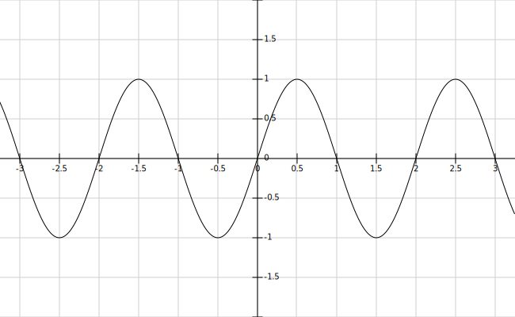

<hr><br>

###### sawWave(x,1) ,等价于

```
y=(((x % 1) + 1) % 1) / 1
```

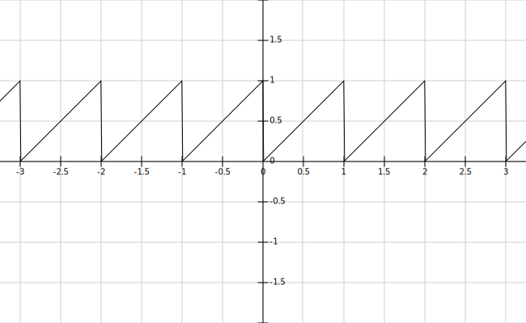

<hr><br>

###### triWave(x,1) ,等价于

```
y = 1 - Math.abs((((x % 1) + 1) % 1) - 1 / 2) / (1 / 2)
```

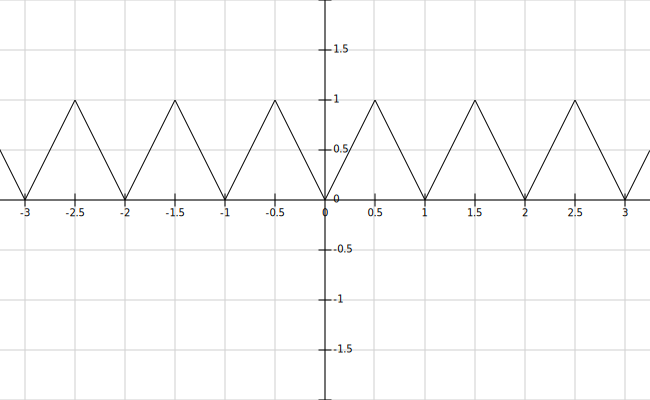

## 表达式说明 <sub style='font-weight:100;'>数学课时间</sub>

### sawWave(t, cycle)

###### step 1：正比例函数（y=x）

```javascript
t = time;
t;
```

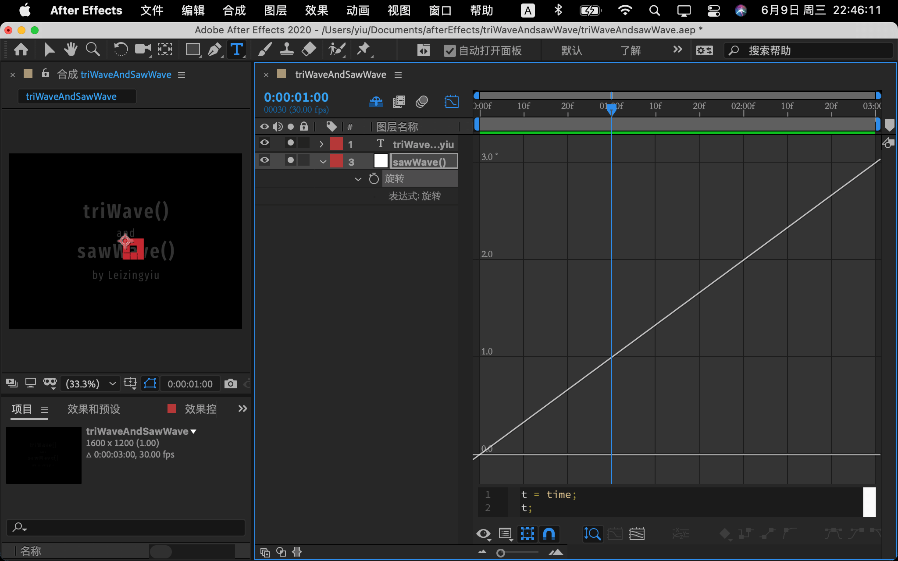

###### step 2：正比例函数，在垂直方向上偏移（y=x-1）

```javascript
t = time - 1;
t;
```


###### step 3：求余数，c=a%b，c=a 除以 b 剩下的余数

```javascript
t = time - 1;
a = 0.5;
t % a;
```

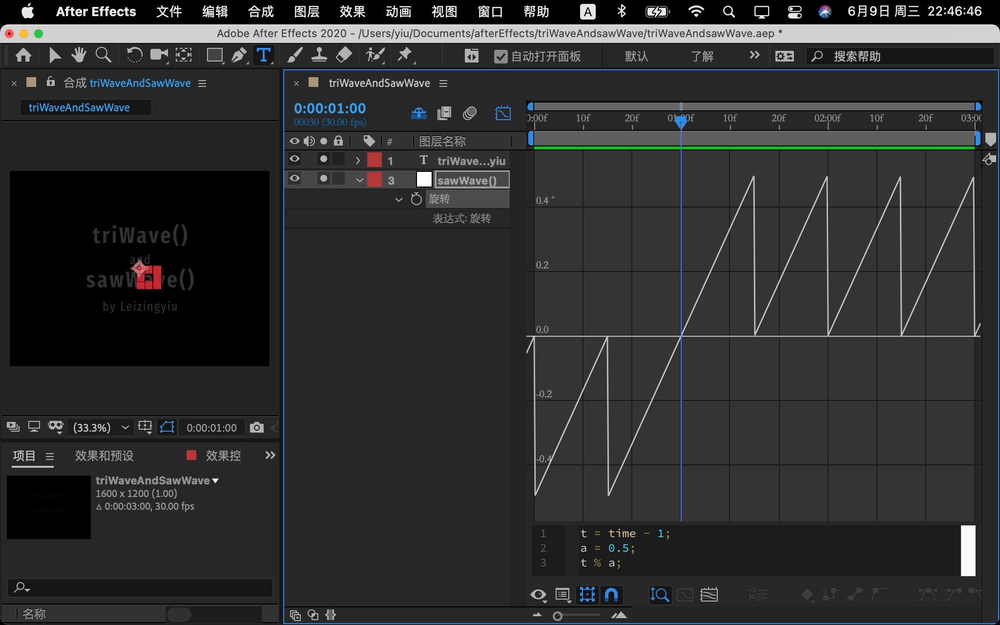

###### step 4：求余结果整体向上移动

```javascript
t = time - 1;
a = 0.5;
(t % a) + a;
```

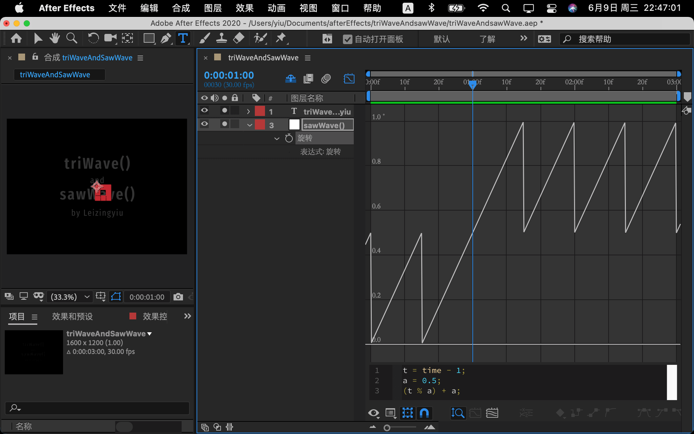

###### step 5：再次求余，此时得到结果全部为正数。

```javascript
t = time - 1;
a = 0.5;
((t % a) + a) % a;
```

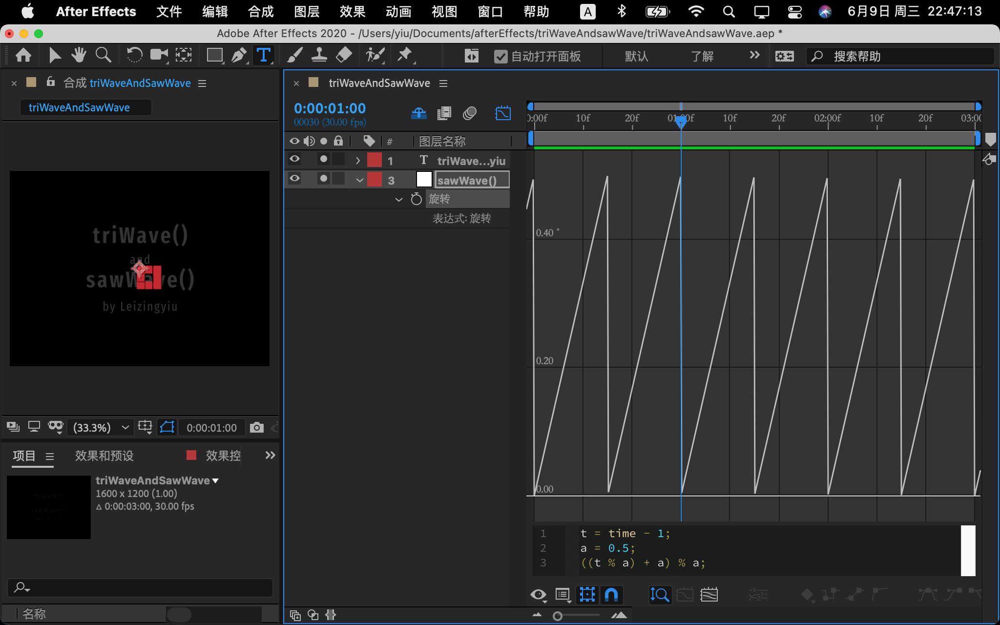

###### step 6：将整体调整到 0 到 1 之间，方便使用。

```javascript
t = time - 1;
a = 0.5;
(((t % a) + a) % a) / a;
```


###### 整理：

```javascript
function sawWave(t, cycle) {
  return (((t % cycle) + cycle) % cycle) / cycle; //by leizingyiu
}
sawWave(time, 1);
```

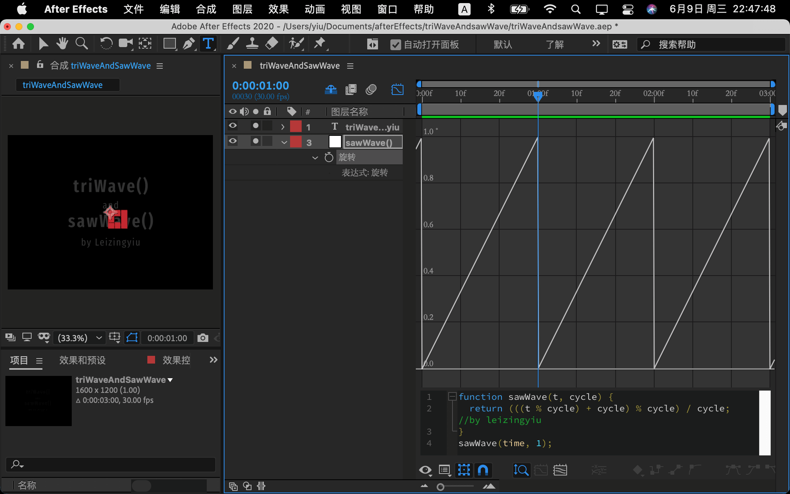
</br></br></br>

### triWave(t, cycle)

###### step 1：正比例函数

```javascript
t = time - 1;
t;
```

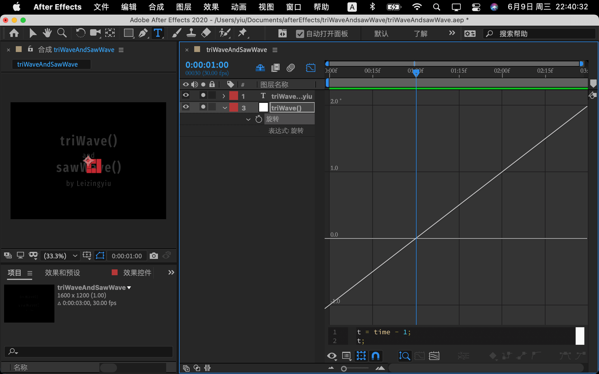

###### step 2：求余

```javascript
t = time - 1;
a = 0.5;
t % a;
```

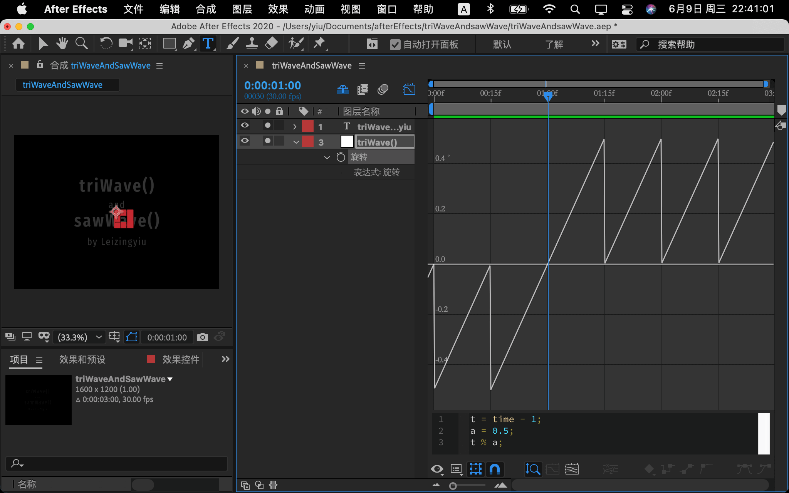

###### step 3：整体向上移动

```javascript
t = time - 1;
a = 0.5;
(t % a) + a;
```

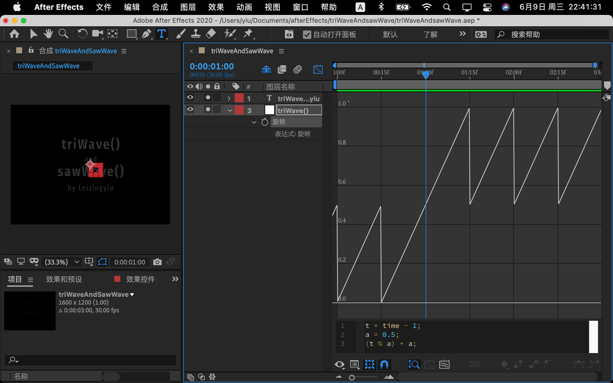

###### step 4：再次求余

```javascript
t = time - 1;
a = 0.5;
((t % a) + a) % a;
```

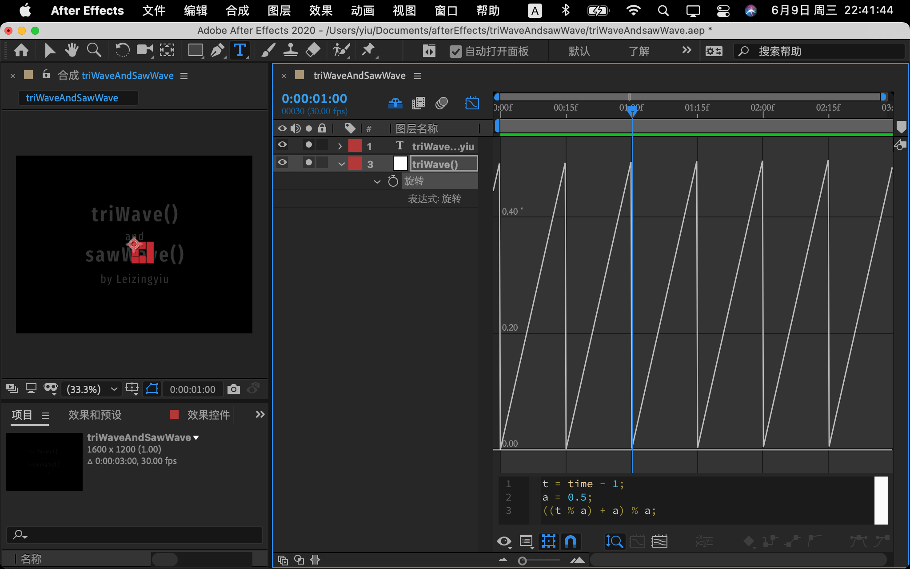

###### step 5：整体向下移动一半

```javascript
t = time - 1;
a = 0.5;
(((t % a) + a) % a) - a / 2;
```

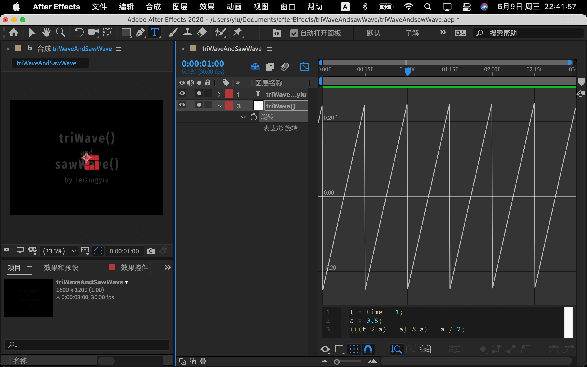

###### step 6：全部进行绝对值运算

```javascript
t = time - 1;
a = 0.5;
Math.abs((((t % a) + a) % a) - a / 2);
```

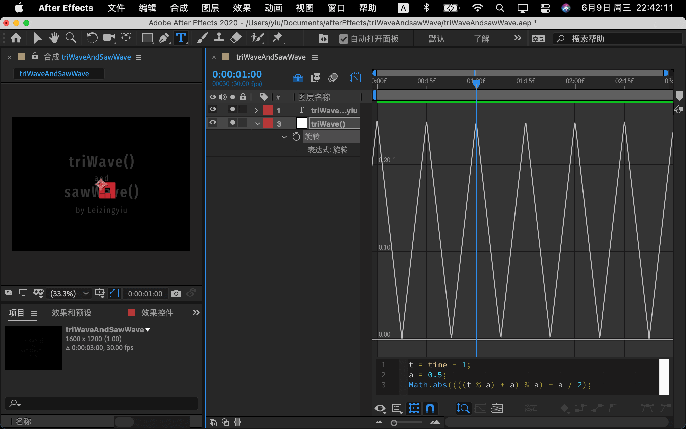

###### step 7：调整到 0 到 1 之间

```javascript
t = time - 1;
a = 0.5;
Math.abs((((t % a) + a) % a) - a / 2) / (a / 2);
```

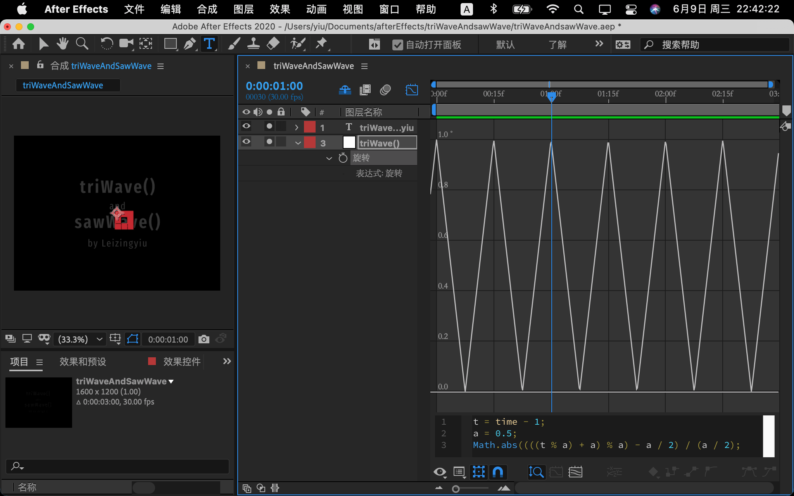

###### step 8：求与 1 的差，使 t 等于 0 的时候，输出 0

```javascript
t = time - 1;
a = 0.5;
1 - Math.abs((((t % a) + a) % a) - a / 2) / (a / 2);
```


###### 整理：

```javascript
function triWave(t, cycle) {
  return (
    1 - Math.abs((((t % cycle) + cycle) % cycle) - cycle / 2) / (cycle / 2)
  ); //by leizingyiu
}
triWave(time, 1);
```

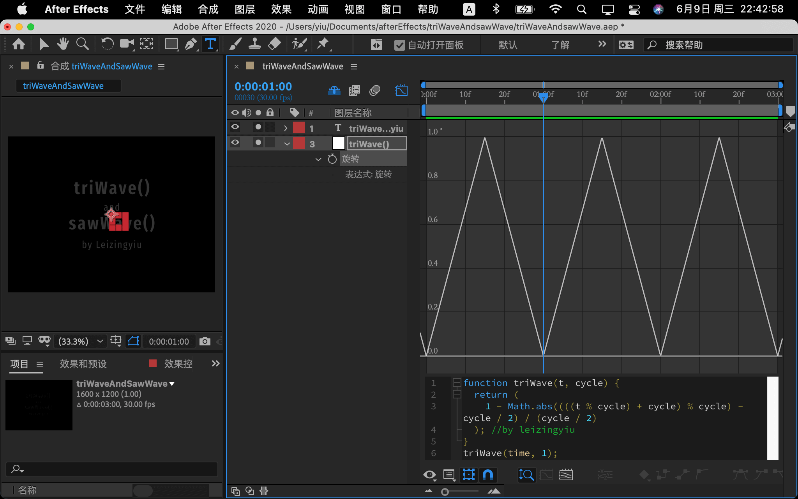

<br><br><br><br>
